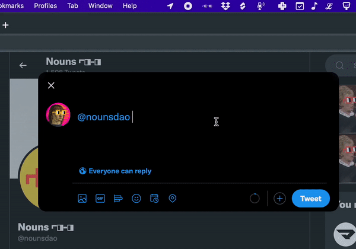

# ⌐◧-◧.app
### Quickly copy unicode noggles to your clipboard

### Installation & usage
**Mac** \
_Note: ⌐◧-◧.app is Mac-only during beta._
1. [Download `⌐◧-◧.app`](https://github.com/ripe0x/noggles.app/releases/download/%E2%8C%90%E2%97%A7-%E2%97%A7%400.0.1/noggles.app.zip)
2. Open the zip file, move `⌐◧-◧.app` to your applications folder, and open the app
3. Proliferate `⌐◧-◧`

### Feedback welcome
If you have any issues using the app or want to share feedback, please [open a Github issue](https://github.com/ripe0x/noggles.app/issues).

Follow [@ripe0x](https://twitter.com/ripe0x) on twitter for updates.

---

⌐◨-◨.app is supported by Nouns DAO through [Prop House #679](https://prop.house/proposal/679).